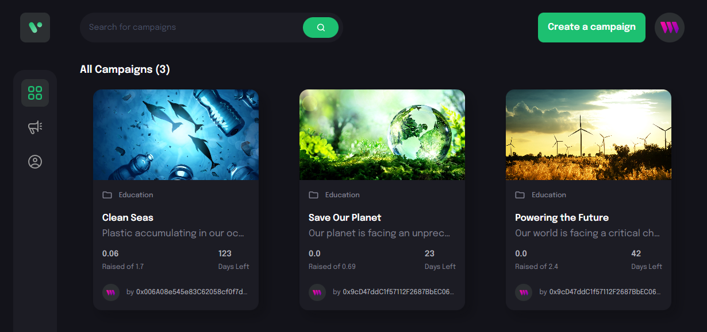

# Crowd Surge

## A minimalistic crowd funding web app

 

## Features

- Create new campaigns
- Support existing campaigns by funding ether (ETH)
- Minimalistic UI
- Mobile responsive

## Tech Stack

- Frontend
  -  Typescript
  -  React
  -  Vite
  -  Tailwind
  -  Ethers.js

- Backend
  -  Ethereum
  -  Hardhat

 

***Note*:** Currently only deployed on sepolia and goerli ethereum test networks